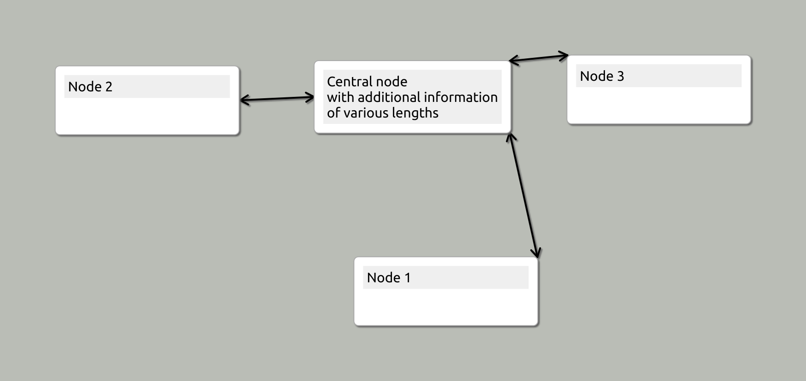
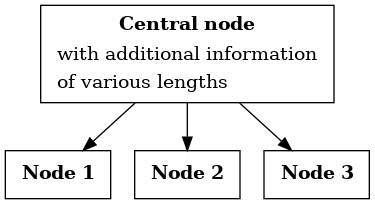
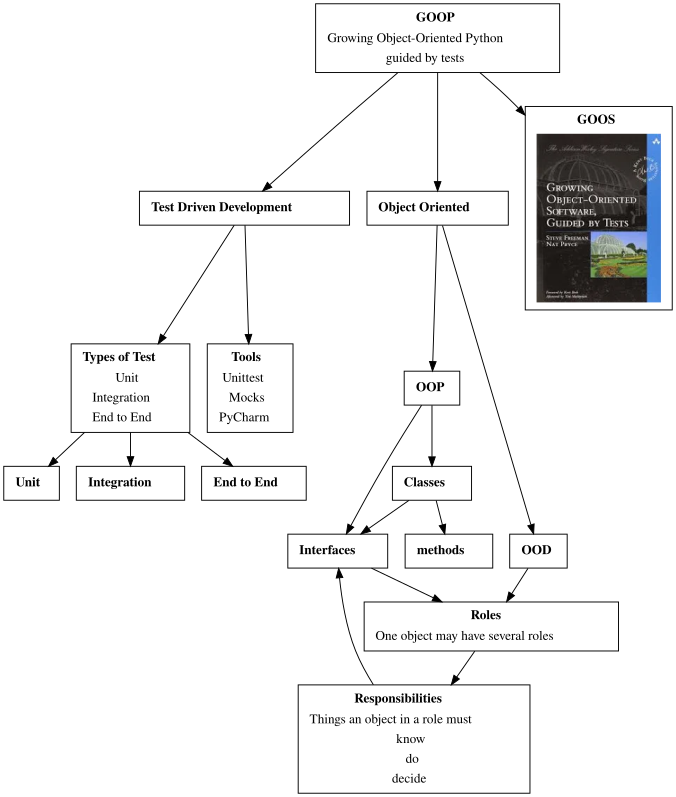

# Heimer tools

**NB:** This is still Alpha sofwtare. _It may be buggy, and the API will change._

Python code to read and transform [Heimer](https://github.com/juzzlin/Heimer) maps.

Heimer maps are concept maps. I find the software to edit them is very intuitive, and I expect to use them a lot.

Since I use other tools for PKM (Personal Knowledge Management) I have started to create tools to transform between 
the Heimer format and others that I use.

The first transformation is from a Heimer file to [graphviz]() `dot` format.

Here's the simple Heimer test map:

And here's the dot output:

## Roadmap

`heimer-tools` already handles images: here is the output from a real *work in progress*:

It's still Alpha software, so the API is likely change.
It's already functional enough to be useful, however,
so my next task will be to publish it on PyPi.