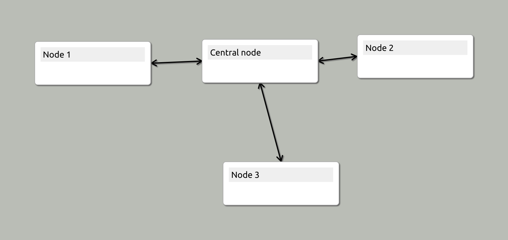
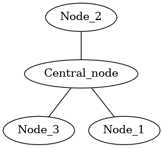

# Heimer tools

Python code to read and transform [Heimer](https://github.com/juzzlin/Heimer) maps.

Heimer maps are concept maps. I find the software to edit them is very intuitive, and I expect to use them a lot.

Since I use other tools for PKM (Personal Knowledge Management) I have started to create tools to transform between 
the Heimer format and others that I use.

The first transformation is from a Heimer file to [graphviz]() `dot` format.

This is not particularly useful but it acts as a good test of my ability to parse and interpret the file format.

Here's the simple Heimer test map:

And here's the dot output:

